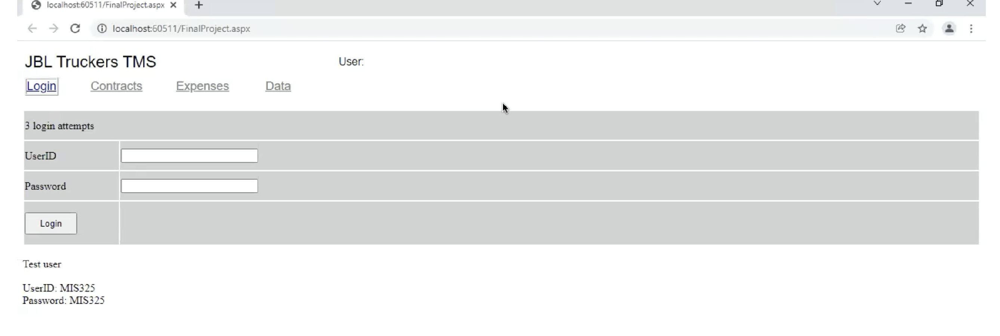
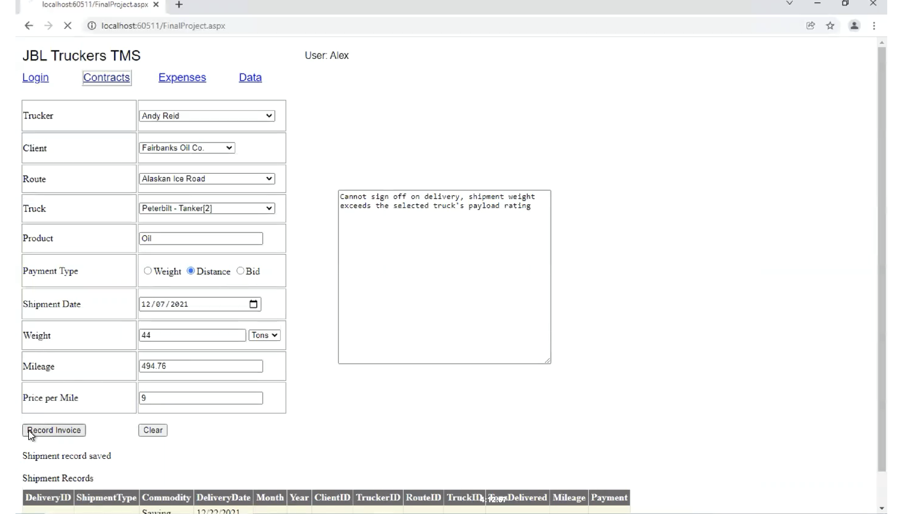
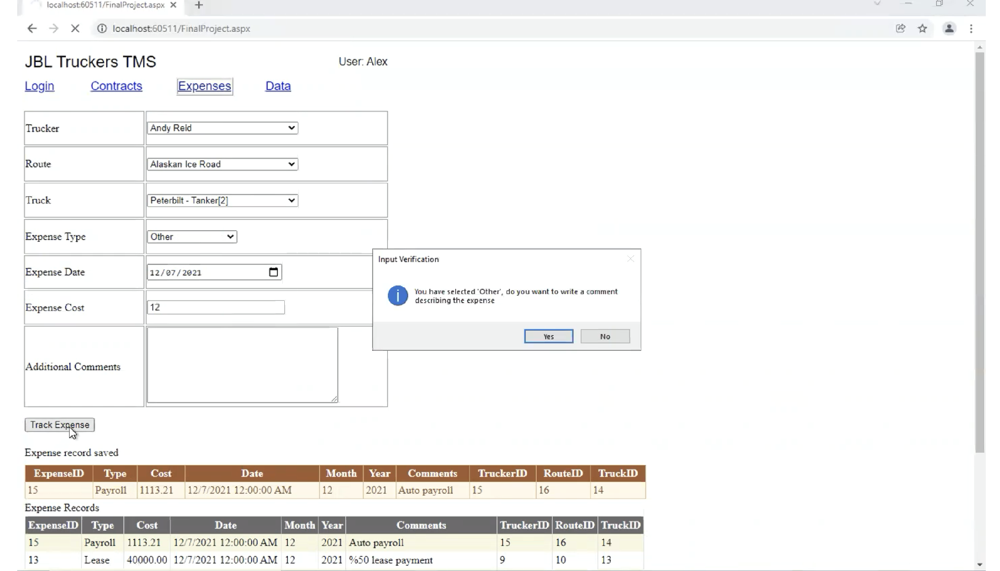
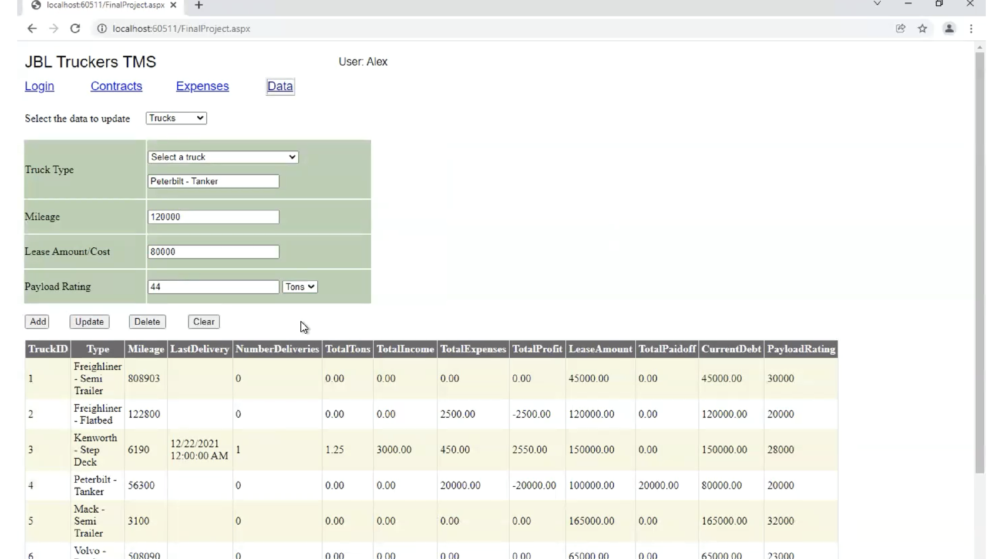

# Transportation Management System

For this project, I built an ASP.NET application in VB.NET with a connection to a SQL Server database. The application acts as a single site to track shipment contracts, expenses, and a feature to add/update data regarding clients, routes, trucks, and drivers for simplifying expenses and contracts creation.

#### Sign in page

#### Contract management (automatic validation check)

#### Expense tracking
After contracts are made, an automatic payroll expense is created.

#### Data page
In this example, users have the ability to add/update trucks and trailers. The applications supports automatic updates to the trucks to provide simple analytics.

